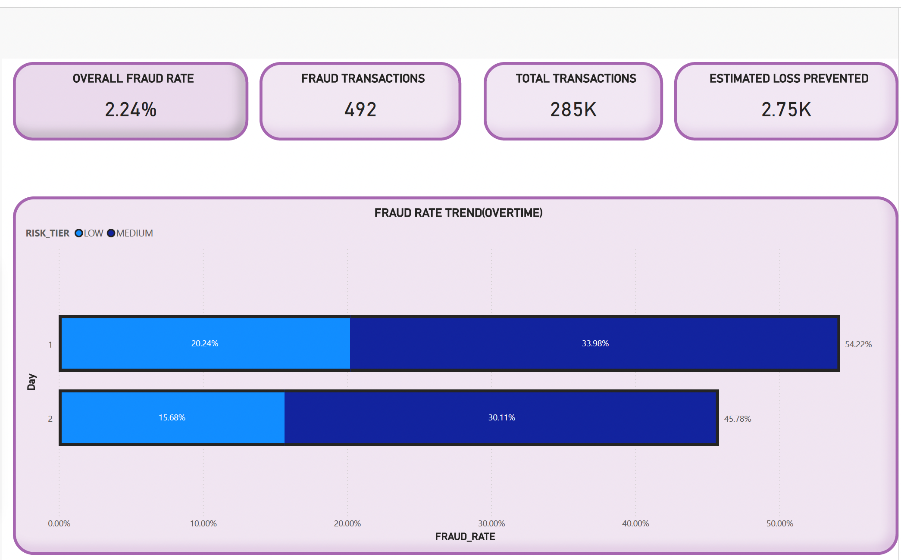
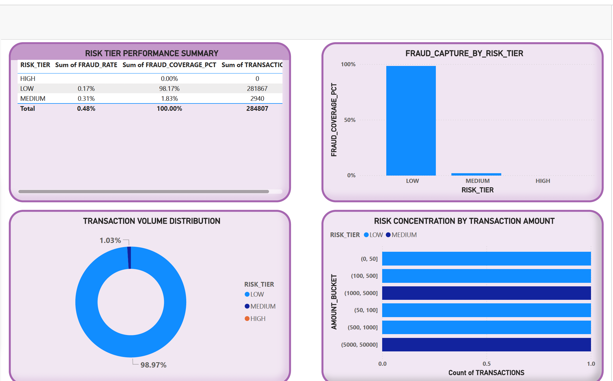
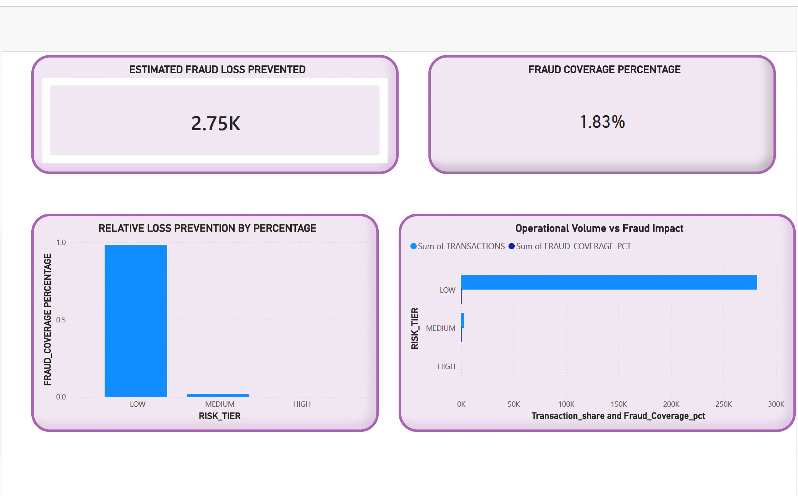

Transaction Anomaly & Risk Detection for Cardm Payments

Role: Mid–Senior Data Analyst
Domain: Financial Services • Payments • Risk Analytics
Tools: Python (Pandas, NumPy, Matplotlib, Seaborn), Snowflake, Power BI

1. Business Context & Objective

The Scenario

Cardm is a digital payments provider processing hundreds of thousands of card transactions daily. Leadership is preparing for a quarterly risk and operations review and requires clarity on three critical questions:

Risk Concentration: Where is fraud risk actually concentrated across transactions?

Operational Efficiency: Are current review controls balancing fraud prevention with customer friction?

Financial Impact: Do expanded review strategies meaningfully reduce losses, or do they introduce excessive operational cost?

The Problem

Fraud is rare (<0.2%) but disproportionately costly. While multiple risk signals exist, applying controls too broadly increases manual review workload and customer disruption. Applying them too narrowly allows fraud leakage.

Raw transaction data alone does not reveal whether intervention is economically justified.

The Objective

To analyze transaction behavior, engineer interpretable risk signals, and evaluate whether expanding review criteria improves outcomes without creating negative net impact.

The goal was not to build a predictive model, but to support executive decision-making around risk controls.

2. Data Architecture & Scope
Dataset Overview

The project uses a large-scale, anonymized credit card transaction dataset containing:

Transaction time (seconds since start)

Transaction amount

PCA-transformed behavioral features

Fraud label (historical outcome)

🛠 Data Architecture & Workflow
I utilized a hybrid environment to ensure scalability and reproducibility:

Snowflake: Hosted the golden analytical datasets; performed initial aggregations.

Python (Pandas/NumPy): Engineered complex behavioral features (e.g., spend-velocity and amount-deviation).

Power BI: Developed a multi-perspective reporting suite for Stakeholders.

Analytical Workflow

Ingestion: Load and validate transaction data in Snowflake and Python

Baseline Analysis: Establish normal transaction behavior

Signal Engineering: Create interpretable risk indicators

Experimentation: Evaluate review strategies via threshold-based A/B testing

Output: Executive-ready dashboards and decision insights

Risk Signal Logic

Rather than "black-box" modeling, I focused on Transparent Signals:
Amount Deviation: $z = \frac{x - \mu}{\sigma}$ (Transaction amount vs. Customer average).
Time-of-Day Risk: Highlighting "Dark Hour" (2 AM - 4 AM) anomalies.
Velocity: Rolling 24-hour transaction counts to detect "burst" fraud.

3. Business Logic & Risk Signal Design

Rather than focusing on black-box models, the analysis emphasized transparent, explainable signals aligned with business logic.
| Risk Signal          | Business Logic Applied                             | Operational Value                                       |
| -------------------- | -------------------------------------------------- | ------------------------------------------------------- |
| Amount Deviation     | Transaction amount relative to customer’s baseline | Identifies behavioral anomalies beyond fixed thresholds |
| Time-of-Day Risk     | Elevated fraud during low-volume overnight hours   | Supports time-based monitoring                          |
| Transaction Velocity | 24-hour rolling transaction count                  | Captures burst behavior indicative of fraud             |
| Risk Tiering         | Rule-based Low / Medium / High tiers               | Enables selective review and prioritization             |

4. Root Cause Analysis & Key Findings
   
🚩 Case 1: Behavioral Deviation as a Fraud Indicator

Finding:
Fraudulent transactions exhibit significantly higher deviation from a customer’s typical spend compared to non-fraud transactions.

Business Risk:
Static amount thresholds miss fraud that is contextually abnormal but not absolutely large.

Action Taken:
Incorporated relative deviation as a supplemental risk signal for review escalation.

🚩 Case 2: Review Expansion Trade-Off

Finding:
Expanding review criteria to include behavioral deviation increased fraud recall but caused a sharp rise in flagged transactions.

Business Risk:
Operational costs increased faster than fraud losses prevented.

Action Taken:
Evaluated expanded controls via an A/B-style threshold tuning experiment.

5. Threshold Tuning Experiment (A/B)

| Group             | Review Strategy                          |
| ----------------- | ---------------------------------------- |
| **Control (A)**   | Review only highest-risk transactions    |
| **Treatment (B)** | Expanded review using behavioral signals |

 | Metric             | Control | Treatment  |
| ------------------ | ------- | ---------- |
| Flag Rate          | ~0%     | 12.6%      |
| Fraud Recall       | 0%      | 19.5%      |
| Review Cost ($)    | $0      | $537K      |
| Loss Prevented ($) | $0      | $24K       |
| **Net Impact ($)** | $0      | **–$513K** |

Strategic Decision: Rejected the expansion. The analysis proved that catching an additional $24K in fraud isn't worth a $537K operational bill. Instead, I recommend Automated Step-up Authentication (MFA) for medium-risk tiers to reduce manual review costs.

6. Final Deliverables

The following assets were produced:

✅ Golden Analytical Dataset
Cleaned, enriched, and structured for downstream analysis and BI consumption.

📊 Power BI Dashboards

Executive overview of fraud and risk concentration

Operational review and customer friction indicators

Finance view of cost vs. loss trade-offs

📘 Analyst Notebook
End-to-end analysis documenting assumptions, logic, experimentation, and decisions.

7. Assumptions & Limitations

Customer identifiers were simulated for analytical demonstration

Fraud labels reflect historical outcomes, not real-time detection

Review costs are estimated and scenario-based

No production deployment or feedback loop implemented

🏆 Skills Demonstrated
Hard Skills

Risk Analytics • Behavioral Analysis • Threshold Optimization • Data Validation • Financial Impact Analysis • BI Storytelling

Soft Skills

Business Acumen • Analytical Skepticism • Decision Framing • Stakeholder Communication • Trade-Off Analysis
